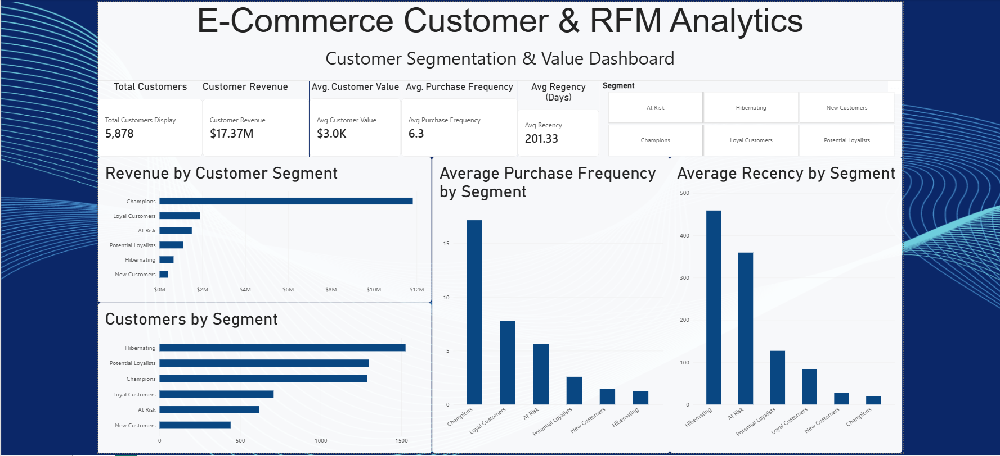

# ecommerce-customer-analytics
E-commerce customer analytics project using SQL, Python, and Power BI to analyze purchasing behavior, customer value, retention, and RFM segmentation.


# 🛒 E-Commerce Customer & RFM Analytics

## Project Overview

This project analyzes e-commerce transaction data to understand customer purchasing behavior, customer value, repeat purchasing, and customer retention opportunities.

Using **Python, pandas, SQL, MySQL, Power BI, and DAX**, more than one million raw transaction records were processed and transformed into an RFM customer segmentation model.

The final analysis contains **779,425 cleaned transactions** and **5,878 identifiable customers**.

---

## 📊 Dashboard



The interactive Power BI dashboard allows users to explore customer segments and compare customer value, purchase frequency, recency, and revenue.

---

## 🛠️ Tools & Technologies

- **Python** — Data cleaning, transformation, feature engineering, and RFM segmentation
- **pandas** — Transaction processing and customer-level analysis
- **MySQL** — Database management
- **SQL** — Customer, product, geographic, and revenue analysis
- **Power BI** — Interactive dashboard development
- **DAX** — KPI measures and dashboard calculations
- **GitHub** — Project documentation and version control

---

## 🎯 Business Questions

This project was designed to answer:

- Who are the company's most valuable customers?
- How much revenue does each customer segment generate?
- Which customers are most likely to require re-engagement?
- How frequently do customers purchase?
- What percentage of customers make repeat purchases?
- Which countries generate the most revenue?
- Which products generate the most revenue?
- How does revenue change over time?
- How can customers be grouped into actionable marketing segments?

---

## 🧹 Data Cleaning

The raw Online Retail II dataset contained several data-quality issues.

Python and pandas were used to identify:

- **243,007** records with missing Customer IDs
- **34,335** duplicate rows
- **22,950** records with zero or negative quantities
- **6,207** records with zero or negative prices
- **19,494** cancelled invoice records

For customer-purchase and RFM analysis, records without identifiable customers, cancelled transactions, invalid quantities/prices, and exact duplicates were removed.

A new feature was also created:

```text
Revenue = Quantity × Price
```

The resulting analytical dataset contained **779,425 valid purchase records**.

---

## 🧠 RFM Customer Segmentation

Customers were segmented using the **RFM framework**:

- **Recency (R)** — How recently the customer purchased
- **Frequency (F)** — Number of unique orders placed
- **Monetary (M)** — Total revenue generated by the customer

Each customer received an R, F, and M score from **1–5** and was assigned to a business-friendly customer segment.

---

## 👥 Customer Segments

| Segment | Customers | Revenue Share |
|---|---:|---:|
| Champions | 1,289 | **68.03%** |
| Loyal Customers | 708 | **10.91%** |
| At Risk | 617 | **8.67%** |
| Potential Loyalists | 1,297 | **6.36%** |
| Hibernating | 1,526 | **3.77%** |
| New Customers | 441 | **2.26%** |

---

## 📈 Executive KPIs

| KPI | Result |
|---|---:|
| Total Revenue | **$17.37M** |
| Total Orders | **36,969** |
| Total Customers | **5,878** |
| Average Order Value | **$469.98** |
| Revenue per Customer | **$2,955.90** |
| Repeat Customers | **4,255** |
| Repeat Purchase Rate | **72.39%** |

---

## 🔍 Key Business Insights

### 1. Champions Drive Most Customer Revenue

Champions represent approximately **22% of customers**, yet generate **68.03% of customer revenue**.

Champions also purchase much more frequently than other customer segments, making them the company's most valuable customer group.

### 2. At-Risk Customers Represent a Significant Revenue Opportunity

There are **617 At Risk customers**.

This segment generated approximately **$150.7K in historical revenue** and has an average customer value of approximately **$2,441.89**.

These customers previously demonstrated meaningful purchasing behavior but have not purchased recently, making them strong candidates for re-engagement campaigns.

### 3. A Large Portion of Customers Are Hibernating

The largest customer segment contains **1,526 Hibernating customers**, approximately **26% of the customer base**.

These customers have high recency and low purchase frequency, indicating low recent engagement.

### 4. Repeat Purchasing Is Strong

**4,255 of 5,878 customers** placed more than one order during the observed period.

This represents a **72.39% repeat purchase rate**.

### 5. The United Kingdom Dominates Revenue

The United Kingdom generated approximately **$14.39M in revenue** and accounted for the majority of customers and orders.

However, several smaller international markets demonstrated substantially higher average order values.

### 6. High-Value Customers Are Highly Concentrated

The highest-revenue customer generated approximately **$581K across 145 orders**.

This demonstrates that a relatively small number of customers can have a substantial impact on total business revenue.

---

## 💡 Business Recommendations

1. **Protect Champion customers**  
   Provide loyalty rewards, early product access, personalized offers, and VIP experiences to retain the company's highest-value customers.

2. **Re-engage At Risk customers**  
   Use targeted win-back campaigns, personalized recommendations, and limited-time incentives.

3. **Develop Potential Loyalists**  
   Encourage additional purchases through loyalty programs, product recommendations, and targeted follow-up campaigns.

4. **Convert New Customers into repeat buyers**  
   Use onboarding emails, second-purchase incentives, and personalized recommendations shortly after the first purchase.

5. **Use customer value alongside revenue**  
   Evaluate customer performance using purchase frequency, recency, and monetary value rather than revenue alone.

6. **Investigate high-value international markets**  
   Markets with smaller customer bases but high average order values may provide opportunities for targeted international growth.

---

## 🔄 Project Workflow

```text
Raw Online Retail II Dataset
        ↓
Python + pandas
        ↓
Data Quality Assessment
        ↓
Data Cleaning
        ↓
Revenue Feature Engineering
        ↓
RFM Calculation
        ↓
Customer Segmentation
        ↓
MySQL + SQL Business Analysis
        ↓
Power BI + DAX
        ↓
Interactive RFM Dashboard
        ↓
Business Recommendations
```

---

## 📁 Repository Structure

```text
ecommerce-customer-analytics/
│
├── data/
│   ├── raw/
│   │   └── README.md
│   │
│   └── cleaned/
│       ├── rfm_customer_segments.csv
│       └── rfm_segment_summary.csv
│
├── python/
│   ├── data_cleaning.py
│   └── rfm_analysis.py
│
├── sql/
│   └── business_analysis.sql
│
├── dashboard/
│   └── ecommerce_customer_dashboard.pbix
│
├── images/
│   └── ecommerce_customer_dashboard.png
│
├── insights/
│
└── README.md
```

---

## 📌 Dataset

This project uses the **Online Retail II** dataset from the UCI Machine Learning Repository.

The original dataset is not stored in this repository because of its file size.

Dataset source:

https://archive.ics.uci.edu/dataset/502/online+retail+ii

---

## 🧩 Skills Demonstrated

**Python • pandas • Data Cleaning • Feature Engineering • RFM Analysis • Customer Segmentation • SQL • MySQL • Power BI • DAX • Customer Analytics • Data Visualization • Business Intelligence • Data Storytelling**

---

## 👤 Author

**Jay Jariwala**

Business Analytics Portfolio Project
